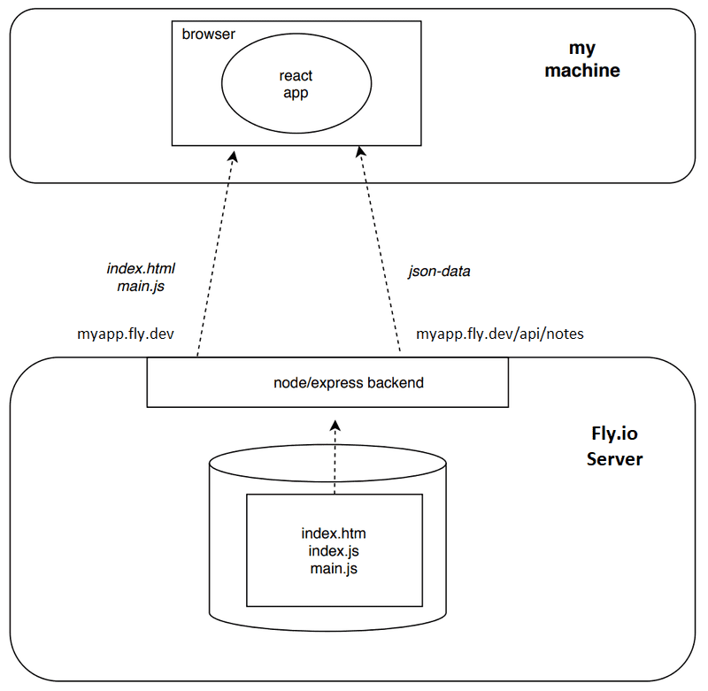

## Notes from the Helsinski Full Stack Open course

## PART 00

- #### Fundamentals of Web apps
  - HTTP GET
  - Traditional web applications
  - Running application logic in the browser
  - Event handlers and Callback functions
  - Document Object Model or DOM
  - Manipulating the document object from console
  - CSS
  - Loading a page containing JavaScript - review
  - Forms and HTTP POST
  - AJAX
  - Single page app
  - JavaScript-libraries
  - Full-stack web development
  - JavaScript fatigue [link](https://auth0.com/blog/how-to-manage-javascript-fatigue/)

## PART 01

- #### Introduction to React
  - create-react-app
  - Component
  - JSX
  - Multiple components
  - props: passing data to components
  - Possible error message
  - Some notes
  - Do not render objects
  - Vite --> `create vite@latest -- --template react.`
- #### JavaScript
  - Variables
  - Arrays
  - Objects
  - Functions
  - Exercises 1.3.-1.5.
  - Object methods and "this"
  - Classes
  - JavaScript materials
- #### Component state, event handlers
  - Component helper functions
  - Destructuring
  - Page re-rendering
  - Stateful component
  - Event handling
  - An event handler is a function
  - Passing state - to child components
  - Changes in state cause re-rendering
  - Refactoring the components
- #### A more complex state, debugging React apps
  - Complex state
  - Handling arrays
  - Update of the state is asynchronous
  - Conditional rendering
  - Old React
  - Debugging React applications
  - Rules of Hooks
  - Event Handling Revisited
  - A function that returns a function
  - Passing Event Handlers to Child Components
  - Do Not Define Components Within Components
  - Useful Reading
  - Web programmers oath
  - Utilization of Large language models

## PART 02

- #### Rendering a collection, modules
  - [Visual Studio Code snippets](https://code.visualstudio.com/docs/editor/userdefinedsnippets#_creating-your-own-snippets)
  - JavaScript Arrays (find, filter, and map)
    [- Higher-order functions](https://www.youtube.com/playlist?list=PL0zVEGEvSaeEd9hlmCXrk5yUyqUag-n84)
    - Map
    - Reduce basics
  - [Event Handlers Revisited](https://fullstackopen.com/en/part1/a_more_complex_state_debugging_react_apps#event-handling-revisited)
  - Rendering Collections
  - Key-attribute
  - Map
  - Anti-pattern: [Array Indexes as Keys](https://robinpokorny.medium.com/index-as-a-key-is-an-anti-pattern-e0349aece318)
  - Refactoring Modules
    [- importing modules](https://developer.mozilla.org/en-US/docs/Web/JavaScript/Reference/Statements/import)
  - When the Application Breaks
  - Web developer's oath
- #### Forms
  - Saving the notes in the component state
  - [Controlled component](https://react.dev/reference/react-dom/components/input#controlling-an-input-with-a-state-variable)
  - Filtering Displayed Elements
    - [array.filter](https://developer.mozilla.org/en-US/docs/Web/JavaScript/Reference/Global_Objects/Array/filter)
    - [Check Object Equality in JavaScript](https://www.joshbritz.co/posts/why-its-so-hard-to-check-object-equality/)
      - [Lodash library for comparisons](https://lodash.com/docs/4.17.15#isEqual))
- #### Getting data from server
  - The browser as a runtime environment
    - [JSON server](https://github.com/typicode/json-server)
      - install the package: `npm install json-server --save-dev`
      - Make an addition to the scripts part of the package.json file:`"server": "json-server -p3001 --watch db.json"`
    - [ IO operations (input/output)](https://en.wikipedia.org/wiki/Input/output)
    - [Web Workers](https://developer.mozilla.org/en-US/docs/Web/API/Web_Workers_API/Using_web_workers)
  - npm
    - Runtime Dependency: A runtime dependency is a package that is required for your application to run correctly in a production environment -> 'npm install <package-name> '
    - Development Dependency: is only needed during the development process, but not during the actual runtime of your application -> 'npm install <package-name> --save-dev'
    - [fetch()](https://developer.mozilla.org/en-US/docs/Web/API/fetch)
  - [Axios and promises](https://github.com/axios/axios)
    - [Axios' method get returns a promise](https://developer.mozilla.org/en-US/docs/Web/JavaScript/Guide/Using_promises)
  - [Effect-hooks](https://react.dev/reference/react/hooks#effect-hooks)
    - [Video deeply explained](https://www.youtube.com/watch?v=3Wb9l18KoxI)
    - By default, effects run after every completed render, but you can choose to fire it only when certain values have changed.
    - [Important: React Lifecycle of a Functional Component](https://www.youtube.com/watch?v=Zz9pLellSQA)
  - The development runtime environment
- #### Altering data in server
  - [REST](https://en.wikipedia.org/wiki/REST)
    - [HTTP request methods](https://developer.mozilla.org/en-US/docs/Web/HTTP/Methods)
  - Sending Data to the Server
    - REST terminology, individual data objects === resources
  - Changing the Importance of Notes
  - Extracting Communication with the Backend ito a Separate Module
    - [Single-responsibility principle:](https://en.wikipedia.org/wiki/Single-responsibility_principle) "A module should be responsible to one, and only one, actor."
    - src/services directory
  - Cleaner Syntax for Defining Object Literals
    - [Promises chaining](https://javascript.info/promise-chaining)
  - Promises and Errors
- #### Adding styles to React app
  - Improved error message
    - [CSS selectors](https://developer.mozilla.org/en-US/docs/Web/CSS/CSS_Selectors)
    - [CSS preprocessor](https://developer.mozilla.org/en-US/docs/Glossary/CSS_preprocessor)
      - Old school CSS = single file without using a CSS preprocessor
      - Tailwind CSS use [PostCSS](https://postcss.org/) as preprocessor
  - [Inline styles](https://react-cn.github.io/react/tips/inline-styles.html)
    - limitations: [pseudo-classes](https://developer.mozilla.org/en-US/docs/Web/CSS/Pseudo-classes) can't be used straightforwardly.
  - Couple of important remarks
    - we can not call method map of the value null = warning with initial null / server errors cases.
    - the initialization of the state "masked" the problem that is caused by the fact that the data is not yet fetched from the backend.
    - conditional rendering => return null if the component state is not properly initialized:
      - cases where it is impossible to define the state so that the initial rendering is possible.
    - [ Vite Enviromental variables](https://vitejs.dev/guide/env-and-mode.html) to save keys
      - [Vite .env video tutorial](https://www.youtube.com/watch?v=jqCjflIGH1o)
    - Important extra learnings from working with APIs
      - You can get blocked by accidently looping in excess!!
        - To prevent it, use a **debounce** technique: limit the rate at which a function is executed. Triggering Events --> Delay --> Resetting the Delay --> Executing the Function
        - [Debounce and throttle](https://www.youtube.com/watch?v=cjIswDCKgu0)

## Part 03

- #### Node.js and Express
  - Node
    - versioning model used in npm = [semantic versioning.](https://docs.npmjs.com/about-semantic-versioning)
      - If the major number of a dependency does not change, then the newer versions should be backwards compatible. This means that if our application happened to use version 4.99.175 of Express in the future, then all the code implemented in this part would still have to work without making changes to the code. In contrast, the future 5.0.0 version of Express may contain changes that would cause our application to no longer work.
    - updating Node using [Node Version Manager](https://github.com/nvm-sh/nvm) (nvm) - Check the available Node.js versions `nvm ls-remote` -> `nvm install <version>`
    - you can switch to the newly installed version with: `nvm use <version>` --> `nvm alias default <version>` To set a default Node.js version to be used across terminal sessions.
    - **Package.json file** defines commonly used npm scripts:
      - start": "node index.js" --> we can ran `npm start` now to start the server
      - "test": "echo \"Error: no test specified\" && exit 1" --> we need to add testing library.
    - `const http = require('http')` --> application imports Node's built-in web server module.
    - `createServer()` method of the http module to create a new web server
  - Express
    - [transitive dependencies](https://lexi-lambda.github.io/blog/2016/08/24/understanding-the-npm-dependency-model/)
      - import express (is a function)
      - define routes to the application
        - define event handler HTTP requests
        - Express automatically sets the Content-Type header
      - [nodemon](https://github.com/remy/nodemon) to easy restart the server `npm install --save-dev nodemon` --> install it as a Dev dependency
  - REST -> Representational State Transfer
    - how RESTful APIs are typically understood in web applications. REST refers to as a uniform interface, which means a consistent way of defining interfaces that makes it possible for systems to cooperate.
      - Singular things (like notes) are called **resources** in RESTful thinking. Every resource has an associated URL which is the **resource's unique address**.
        - One convention for creating unique addresses is to combine the name of the resource type with the resource's unique identifier.
        - We can execute different operations on resources. The operation to be executed is defined by the HTTP verb.
          URL | verb | functionality
          notes/10 | GET | fetches a single resource
          notes | GET | fetches all resources in the collection
          notes | POST | creates a new resource based on the request data
          notes/10 | DELETE | removes the identified resource
          notes/10 | PUT | replaces the entire identified resource with the request data
          notes/10 | PATCH | replaces a part of the identified resource with the request data
        - [Route params](http://expressjs.com/en/guide/routing.html#route-parameters) --> using the colon syntax`:`
        - for bar request, we can add special methods to the response:
          - [.status(400)](https://expressjs.com/en/4x/api.html#res.status) => Sets the HTTP status for the response
          - [.end()](https://expressjs.com/en/4x/api.html#res.end) => Ends the response process.
    - [The Visual Studio Code REST client](https://github.com/Huachao/vscode-restclient/blob/master/README.md#usage)
      - 1. make a directory at the root of the application named requests.
      - 2. create a new get_all_notes.rest file and define the request that fetches all notes.
        - Add multiple requests in the same file using ### separators between requests.
  - Receiving data
    - HTTP POST request to the address with the request body in JSON format.
      - To access the data easily, we need the help of the Express [json-parser](https://expressjs.com/en/api.html) that we can use with the command `app.use(express.json())`. Without the json-parser, the body property would be undefined. The json-parser takes the JSON data of a request, transforms it into a JavaScript object and then attaches it to the body property of the request object before the route handler is called.
      - JavaScript objects cannot be directly passed through HTTP requests without being converted into a format that can be transmitted over the network, such as a JSON string
        - HTTP is a text-based protocol, meaning it can only transmit text data.
        -
  - About HTTP request types
    - **Safety**: GET and HEAD methods SHOULD NOT have the significance of taking an action other than retrieval. The executing request must not cause any side effects on the server. By side effects, we mean that the state of the database must not change as a result of the request, and the response must only return data that already exists on the server.
    - **Idempotency**: All HTTP requests except POST should be idempotent:
    - _POST is the only HTTP request type that is neither safe nor idempotent._ If we send 5 different HTTP POST requests to /api/notes with a body of {content: "many same", important: true}, the resulting 5 notes on the server will all have the same content.
  - Middleware
    - Functions that can be used for handling request and response objects.
    - In practice, you can use several middlewares at the same time. When you have more than one, they're executed one by one in the order that they were listed in the application code.
    - Middleware is used like this: `app.use(requestLogger)`
      - Middleware functions have to be used before routes when we want them to be executed by the route event handlers. Sometimes, we want to use middleware functions after routes. We do this when the middleware functions are only called if no route handler processes the HTTP request.
    - [Morgan](https://github.com/expressjs/morgan) npm package: HTTP request logger middleware for node.js

- #### Deploying app to internet

  - A. [Same origin policy and CORS](https://developer.mozilla.org/en-US/docs/Web/Security/Same-origin_policy)
    - Universal principles regarding the safe operation of web applications (not specific to React or Node)
    - Origin policy un a nutshell:
      - The same-origin policy is a security mechanism implemented by browsers in order to prevent session hijacking among other security vulnerabilities
      - URL's origin is defined by the combination of **protocol** (AKA scheme), **hostname**, and **port**.
      ```
      http://example.com:80/index.html
      protocol: http
      host: example.com
      port: 80
      ```
      - If the resource is fetched using a URL that doesn't share the same origin(scheme, host, port) as the source HTML, the browser will have to check the `Access-Control-Allow-origin` response header. If it contains \* on the URL of the source HTML, the browser will process the response, otherwise the browser will refuse to process it and throws an error.
    - Solution: [Cross-Origin Resource Sharing](https://developer.mozilla.org/en-US/docs/Web/HTTP/CORS) [CORS](https://en.wikipedia.org/wiki/Cross-origin_resource_sharing)
      - install cors package --> `npm install cors`
      - require it on the backend index.js `const cors = require('cors');`
        - add a middleware to enable it: `app.use(cors());`
  
  - B.  Deploying Application to the Internet
    - Side lessons:
      - Problems with repos inside repos -> [git submodule](https://cristianowerneraraujo.medium.com/why-when-and-how-to-use-git-submodules-1a72615de453) = Git repository nested inside another. Useful when you want to include the contents of one Git repository within another Git repository.
        - **STEPS**
          1. Navigate to the Main Project's Directory
          2. Add the Submodule: `git submodule add <repository_URL> <submodule path>`
          3. Commit the Changes and then push them
    - For small projects, we can use PaaS (Servers as Plataforms) free tier options
      - [Fly.io](https://fly.io/) or [Render](https://render.com)
      - Adjust Port used to [enviroment variables](https://en.wikipedia.org/wiki/Environment_variable):
        ```
        const PORT = process.env.PORT || 3001
        app.listen(PORT, () => {
        console.log(`Server running on port ${PORT}`)
        })
        ```
  - C.  Frontend production build
    - In development mode the application is configured to give clear error messages, immediately render code changes to the browser, and so on.
    - deployed = create a [Vite production build](https://vitejs.dev/guide/build.html) or a version of the application that is optimized for production. ` npm run build.`
      - This creates a directory called dist which contains the only HTML file of our application (index.html) and the directory assets. [Minified](<https://en.wikipedia.org/wiki/Minification_(programming)>) version of our application's JavaScript code will be generated in the dist directory
  - Serving static files from the backend
    - Running like a **single-page app** option:
      - both the **frontend** and the **backend** are at the same address, we can declare baseUrl as a [relative URL](https://www.w3.org/TR/WD-html40-970917/htmlweb.html#h-5.1.2). This means we can leave out the part declaring the server. Example: `const baseUrl = '/api/notes'`
      - Create a **production build** of the App and copy the production **dist directory** to the root of the backend repository and configure the backend to show the frontend's main page (the file dist/index.html) as its main page. `cp -r dist ../backend`
      - Make **Express** show static content, the page index.html and the JavaScript, etc., it fetches, we need a **built-in middleware** from Express called [static](https://expressjs.com/en/starter/static-files.html). `app.use(express.static('dist'))`
      - The application can now be used from the backend address http://localhost:3001
        - When we use a browser to go to the address http://localhost:3001, the server returns the index.html file from the dist directory. The file contains instructions to fetch a CSS stylesheet defining the styles of the application, and one script tag that instructs the browser to fetch the JavaScript code of the application - the actual React application.
          **- Important** Unlike when running the app in a development environment, everything is now in the same node/express-backend that runs in localhost:3001. When the browser goes to the page, the file index.html is rendered. That causes the browser to fetch the production version of the React app. Once it starts to run, it fetches the json-data from the address localhost:3001/api/notes.
  - The whole app to the internet
    - The node/express-backend now resides in the Fly.io/Render server. When the root address is accessed, the browser loads and executes the React app that fetches the json-data from the Fly.io/Render server.
      
  - Streamlining deploying of the frontend
    - Script to create a new production build of the frontend (custom script on the **backend package.json**)
      - render.com
        ```
        {
          "scripts": {
            //...
            "build:ui": "rm -rf dist && cd ../frontend && npm run build && cp -r dist ../backend",
            "deploy:full": "npm run build:ui && git add . && git commit -m uibuild && git push"
          }
        }
        ```
        - `npm run build:ui` = builds the frontend and copies the production version under the backend repository.
        - `npm run deploy:full` = contains also the necessary git commands to update the backend repository.
  - D. Vite [Proxy](https://vitejs.dev/config/server-options.html#server-proxy)
    If the React code does an HTTP request that are made to paths starting with what we define(in our case '/api') to a server address at http://localhost:5173 not managed by the React application itself (i.e. when requests are not about fetching the CSS or JavaScript of the application), the request will be redirected to the server at http://localhost:3001.

    - Due to changing the backend address to a relative URL, the connection to the backend does not work.

      - In development mode the frontend is at the address localhost:5173, the requests to the backend go to the wrong address localhost:5173/api/notes. The backend is at localhost:3001.

        - Vite let's us fix this through vite.config.js file of the frontend repository.
        - Previous code:

        ```
        import { defineConfig } from 'vite'
        import react from '@vitejs/plugin-react'

        // https://vitejs.dev/config/
        export default defineConfig({
          plugins: [react()],
        })
        ```

        - New code

        ```
        import { defineConfig } from 'vite'
        import react from '@vitejs/plugin-react'

        // https://vitejs.dev/config/
        export default defineConfig({
          plugins: [react()],
          // Added for reparing the relative url issue after deploying
          server: {
            proxy: {
              '/api': {
                target: 'http://localhost:3001',
                changeOrigin: true,
              },
            }
          },
        })
        ```

    - **Negative aspect**: complicated it is to deploy the frontend. Deploying a new version requires generating a new production build of the frontend and copying it to the backend repository. This makes creating an automated [deployment pipeline](https://martinfowler.com/bliki/DeploymentPipeline.html) more difficult.

- #### Saving data to MongoDB
  
  - Debugging Node applications
  - MongoDB
  - Schema
  - Creating and saving objects
  - Fetching objects from the database
  - Exercise 3.12.
  - Connecting the backend to a database
  - Moving db configuration to its own module
  - Important note to Fly.io users
  - Using database in route handlers
  - Verifying frontend and backend integration
  - Exercises 3.13.-3.14.
  - Error handling
  - Moving error handling into middleware
  - The order of middleware loading
  - Other operations
  - A true full stack developer's oath
  - Exercises 3.15.-3.18.