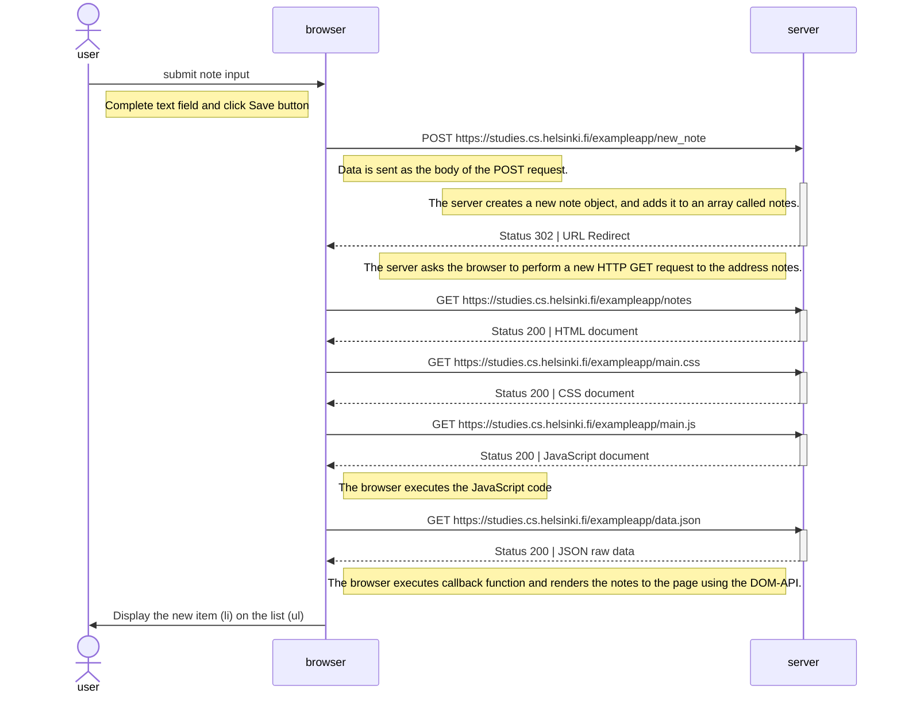

<h3>Scenario: User creates a new note</h3>

```mermaid
sequenceDiagram
    actor user
    participant browser
    participant server


    user->>browser: submit note input
    Note right of user: Complete text field and click Save button
    browser->>server: POST https://studies.cs.helsinki.fi/exampleapp/new_note
    Note right of browser: Data is sent as the body of the POST request.
    activate server
    note left of server: The server creates a new note object, and adds it to an array called notes.
    server-->>browser: Status 302 | URL Redirect
    deactivate server
    Note left of server: The server asks the browser to perform a new HTTP GET request to the address notes.

    browser->>server: GET https://studies.cs.helsinki.fi/exampleapp/notes
    activate server
    server-->>browser: Status 200 | HTML document
    deactivate server

    browser->>server: GET https://studies.cs.helsinki.fi/exampleapp/main.css
    activate server
    server-->>browser: Status 200 | CSS document
    deactivate server

    browser->>server: GET https://studies.cs.helsinki.fi/exampleapp/main.js
    activate server
    server-->>browser: Status 200 | JavaScript document
    deactivate server
    Note right of browser: The browser executes the JavaScript code

    browser->>server: GET https://studies.cs.helsinki.fi/exampleapp/data.json
    activate server
    server-->>browser: Status 200 | JSON raw data
    deactivate server
    Note right of browser: The browser executes callback function and renders the notes to the page using the DOM-API.

    browser ->>user: Display the new item (li) on the list (ul)
```
