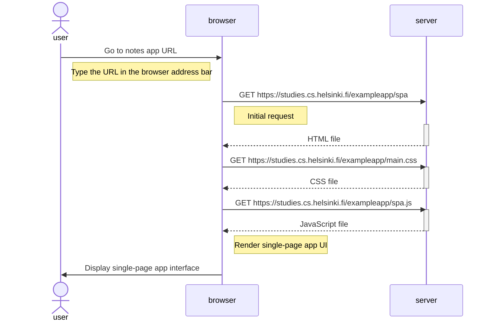

<h3>Scenario: Browse a single page app</h3>

```mermaid
sequenceDiagram
    actor user
    participant browser
    participant server

    user->>browser: Go to notes app URL
    Note right of user: Type the URL in the browser address bar
    browser->>server: GET https://studies.cs.helsinki.fi/exampleapp/spa
    Note right of browser: Initial request
    activate server
    server-->>browser: HTML file
    deactivate server

    browser->>server: GET https://studies.cs.helsinki.fi/exampleapp/main.css
    activate server
    server-->>browser: CSS file
    deactivate server

    browser->>server: GET https://studies.cs.helsinki.fi/exampleapp/spa.js
    activate server
    server-->>browser: JavaScript file
    deactivate server

    note right of browser: Render single-page app UI
    browser ->>user: Display single-page app interface

```
