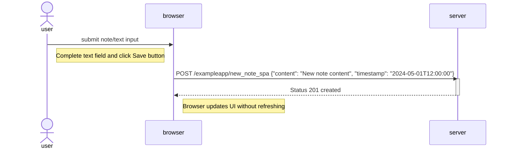

<h3>Scenario: Single create new note on a single page app</h3>

```mermaid
sequenceDiagram
    actor user
    participant browser
    participant server

    user->>browser: submit note/text input
    Note right of user: Complete text field and click Save button
    browser->>server: POST /exampleapp/new_note_spa {"content": "New note content", "timestamp": "2024-05-01T12:00:00"}
    activate server
    server-->>browser: Status 201 created
    deactivate server
    note right of browser: Browser updates UI without refreshing

```
