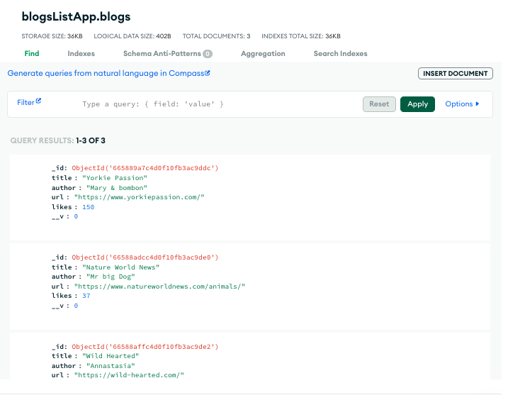
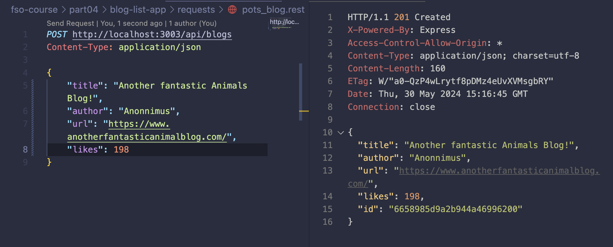

# Blog List App

In the exercises for this part, we will be building a blog list application, that allows users to save information about interesting blogs they have stumbled across on the internet.

For each listed blog we will save:

- author
- title
- URL
- amount of upvotes from users of the application.

- [x] 4.1 Blog List, step 1
  - [x] Application turned into a functioning npm project + executed with nodemon.
  - [x] Database created on MongoDB Atlas (using the same database from the previous part's exercises).
  - [x] 3 Blogs added to the list withVS Code REST
        
- [x] 4.2 Blog List, step 2, refactor the original code into separate modules
  - [x] Utils refactor
  - [x] app.js creation and first refactor
  - [x] model refactor
  - [x] controllers/blogs routes refactor
  - [x] app.js refactor
        
